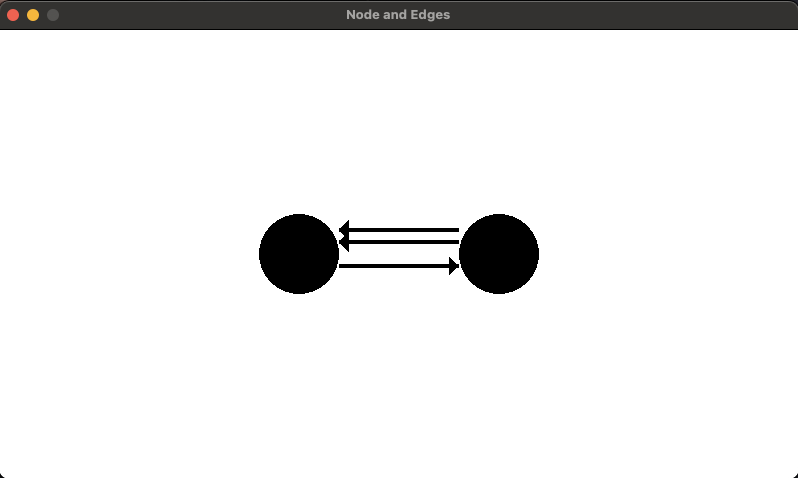
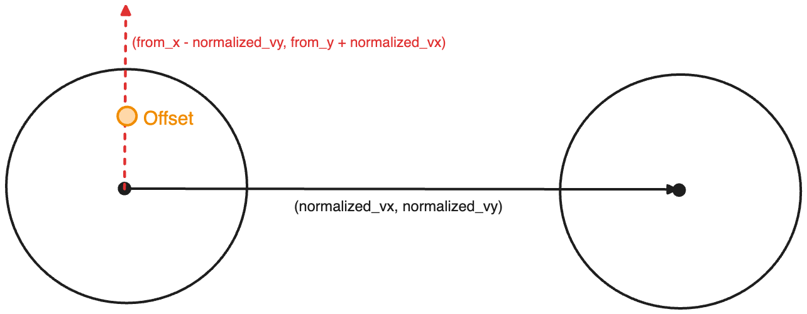

# Multiple edges between Nodes



---

<br/>

This project shows how to create edges between two nodes without overlapping them.

This is done by:

- Draw lines between the circuferences
- Offsetting the lines FROM and TO points

## Draw lines between the circuferences

To draw the lines, we use the center of the circles to connect them.

However, if we simply call `rl.draw_line_ex`, we wouldn't be able to see the arrow head.

That's why we need points must be **outside the circle**. This can done by moving the FROM and TO points based on the **circle radius**:

```python
from_x = int(from_x + Node.radius * normalized_vx)
from_y = int(from_y + Node.radius * normalized_vy)

to_x = int(to_x - Node.radius * normalized_vx)
to_y = int(to_y - Node.radius * normalized_vy)
```

`normalized_vx` and `normalized_vy` are the direction of the resulting vector between FROM and TO points. Because of it, by multiplying it by the radius we can move the point out from the circle.

For the FROM coordinates, we **add the radius**, because the line must start **after** the circumference

For the TO coordinates, we **subtract the radius**, because the line must **stop** before entering the circle

## Offsetting the lines FROM and TO points



If we have two edges between the same nodes, they would overlap. But by using a perpendicular vector we can generate new coordinates by multiplying it by an offset

```python
from_x = (
    from_x
    - (self.edge_offset * normalized_vy) * multiple_edges_count * 1.2
)
from_y = (
    from_y
    + (self.edge_offset * normalized_vx) * multiple_edges_count * 1.2
)
to_x = (
    to_x
    - (self.edge_offset * normalized_vy) * multiple_edges_count * 1.2
)
to_y = (
    to_y
    + (self.edge_offset * normalized_vx) * multiple_edges_count * 1.2
)
```

`multiple_edges_count` is used to create a space between edges originating from the same node

---

###### Notes: I still need to fix arrow heads when nodes are not in the same horizontal line
